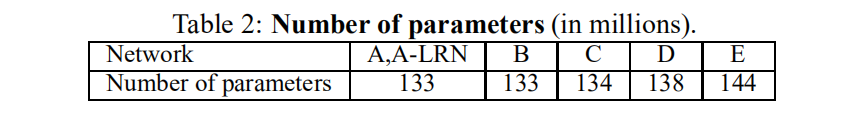
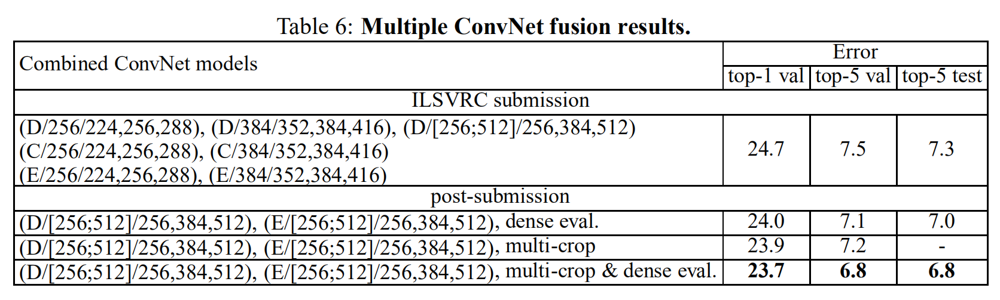

# VERY DEEP CONVOLUTIONAL NETWORKS FOR LARGE-SCALE IMAGE RECOGNITION

## ABSTRACT
In this work we investigate the effect of the convolutional network depth on its accuracy in the large-scale image recognition setting. Our main contribution is a thorough evaluation of networks of increasing depth using an architecture with very small (3 × 3) convolution filters, which shows that a significant improvement on the prior-art configurations can be achieved by pushing the depth to 16–19 weight layers. These findings were the basis of our ImageNet Challenge 2014 submission, where our team secured the first and the second places in the localisation and classification tracks respectively. We also show that our representations generalise well to other datasets, where they achieve state-of-the-art results. We have made our two best-performing ConvNet models publicly available to facilitate further research on the use of deep visual representations in computer vision.

## INTRODUCTION
Convolutional networks (ConvNets) have recently enjoyed a great success in large-scale image and video recognition (Krizhevsky et al., 2012; Zeiler & Fergus, 2013; Sermanet et al., 2014; Simonyan & Zisserman, 2014) which has become possible due to the large public image repositories, such as ImageNet (Deng et al., 2009), and high-performance computing systems, such as GPUs or large-scale distributed clusters (Dean et al., 2012). In particular, an important role in the advance of deep visual recognition architectures has been played by the ImageNet Large-Scale Visual Recognition Challenge (ILSVRC) (Russakovsky et al., 2014), which has served as a testbed for a few generations of large-scale image classification systems, from high-dimensional shallow feature encodings (Perronnin et al., 2010) (the winner of ILSVRC-2011) to deep ConvNets (Krizhevsky et al., 2012) (the winner of ILSVRC-2012).

With ConvNets becoming more of a commodity in the computer vision field, a number of attempts have been made to improve the original architecture of Krizhevsky et al. (2012) in a bid to achieve better accuracy. For instance, the best-performing submissions to the ILSVRC-2013 (Zeiler & Fergus, 2013; Sermanet et al., 2014) utilised smaller receptive window size and smaller stride of the first convolutional layer. Another line of improvements dealt with training and testing the networks densely over the whole image and over multiple scales (Sermanet et al., 2014; Howard, 2014). In this paper, we address another important aspect of ConvNet architecture design – its depth. To this end, we fix other parameters of the architecture, and steadily increase the depth of the network by adding more convolutional layers, which is feasible due to the use of very small (3×3) convolution filters in all layers.

As a result, we come up with significantly more accurate ConvNet architectures, which not only achieve the state-of-the-art accuracy on ILSVRC classification and localisation tasks, but are also applicable to other image recognition datasets, where they achieve excellent performance even when used as a part of a relatively simple pipelines (e.g. deep features classified by a linear SVM without fine-tuning). We have released our two best-performing models to facilitate further research.

The rest of the paper is organised as follows. In Sect. 2, we describe our ConvNet configurations. The details of the image classification training and evaluation are then presented in Sect. 3, and the configurations are compared on the ILSVRC classification task in Sect. 4. Sect. 5 concludes the paper. For completeness, we also describe and assess our ILSVRC-2014 object localisation system in Appendix A, and discuss the generalisation of very deep features to other datasets in Appendix B. Finally, Appendix C contains the list of major paper revisions.

## CONVNET CONFIGURATIONS
To measure the improvement brought by the increased ConvNet depth in a fair setting, all our ConvNet layer configurations are designed using the same principles, inspired by Ciresan et al. (2011); Krizhevsky et al. (2012). In this section, we first describe a generic layout of our ConvNet configurations (Sect. 2.1) and then detail the specific configurations used in the evaluation (Sect. 2.2). Our design choices are then discussed and compared to the prior art in Sect. 2.3.

### ARCHITECTURE
During training, the input to our ConvNets is a fixed-size 224 × 224 RGB image. The only preprocessing we do is subtracting the mean RGB value, computed on the training set, from each pixel. The image is passed through a stack of convolutional (conv.) layers, where we use filters with a very small receptive field: 3 × 3 (which is the smallest size to capture the notion of left/right, up/down, center). In one of the configurations we also utilise 1 × 1 convolution filters, which can be seen as a linear transformation of the input channels (followed by non-linearity). The convolution stride is fixed to 1 pixel; the spatial padding of conv. layer input is such that the spatial resolution is preserved after convolution, i.e. the padding is 1 pixel for 3 × 3 conv. layers. Spatial pooling is carried out by five max-pooling layers, which follow some of the conv. layers (not all the conv. layers are followed by max-pooling). Max-pooling is performed over a 2 × 2 pixel window, with stride 2.

A stack of convolutional layers (which has a different depth in different architectures) is followed by three Fully-Connected (FC) layers: the first two have 4096 channels each, the third performs 1000-way ILSVRC classification and thus contains 1000 channels (one for each class). The final layer is the soft-max layer. The configuration of the fully connected layers is the same in all networks.

All hidden layers are equipped with the rectification (ReLU (Krizhevsky et al., 2012)) non-linearity. We note that none of our networks (except for one) contain Local Response Normalisation (LRN) normalisation (Krizhevsky et al., 2012): as will be shown in Sect. 4, such normalisation does not improve the performance on the ILSVRC dataset, but leads to increased memory consumption and computation time. Where applicable, the parameters for the LRN layer are those of (Krizhevsky et al., 2012).

### CONFIGURATIONS
The ConvNet configurations, evaluated in this paper, are outlined in Table 1, one per column. In the following we will refer to the nets by their names (A–E). All configurations follow the generic design presented in Sect. 2.1, and differ only in the depth: from 11 weight layers in the network A (8 conv. and 3 FC layers) to 19 weight layers in the network E (16 conv. and 3 FC layers). The width of conv. layers (the number of channels) is rather small, starting from 64 in the first layer and then increasing by a factor of 2 after each max-pooling layer, until it reaches 512.

In Table 2 we report the number of parameters for each configuration. In spite of a large depth, the number of weights in our nets is not greater than the number of weights in a more shallow net with larger conv. layer widths and receptive fields (144M weights in (Sermanet et al., 2014)).

Table 1: **ConvNet configurations** (shown in columns). The depth of the configurations increases from the left (A) to the right (E), as more layers are added (the added layers are shown in bold). The convolutional layer parameters are denoted as “$conv \left\langle receptive field size \right\rangle - \left\langle number of channels \right\rangle$ ”. The ReLU activation function is not shown for brevity.

```{r, echo = FALSE}
knitr::include_graphics("img/03-01.png")
```

```{r, echo = FALSE}

```

### DISCUSSION
Our ConvNet configurations are quite different from the ones used in the top-performing entries of the ILSVRC-2012 (Krizhevsky et al., 2012) and ILSVRC-2013 competitions (Zeiler & Fergus, 2013; Sermanet et al., 2014). Rather than using relatively large receptive fields in the first conv. layers (e.g. $11×11$ with stride 4 in (Krizhevsky et al., 2012), or $7×7$ with stride 2 in (Zeiler & Fergus, 2013; Sermanet et al., 2014)), we use very small $3 × 3$ receptive fields throughout the whole net, which are convolved with the input at every pixel (with stride 1). It is easy to see that a stack of two $3×3$ conv. layers (without spatial pooling in between) has an effective receptive field of 5×5; three such layers have a $7 × 7$ effective receptive field. So what have we gained by using, for instance, a stack of three 3×3 conv. layers instead of a single $7×7$ layer? First, we incorporate three non-linear rectification layers instead of a single one, which makes the decision function more discriminative. Second, we decrease the number of parameters: assuming that both the input and the output of a three-layer $3 × 3$ convolution stack has $C$ channels, the stack is parametrised by $3(3^2C^2) = 27C^2$ weights; at the same time, a single $7 × 7$ conv. layer would require $7^2C^2 = 49C^2$ parameters, i.e. $81%$ more. This can be seen as imposing a regularisation on the $7 × 7$ conv. filters, forcing them to have a decomposition through the $3 × 3$ filters (with non-linearity injected in between).

The incorporation of 1 × 1 conv. layers (configuration C, Table 1) is a way to increase the non-linearity of the decision function without affecting the receptive fields of the conv. layers. Even though in our case the 1 × 1 convolution is essentially a linear projection onto the space of the same dimensionality (the number of input and output channels is the same), an additional non-linearity is introduced by the rectification function. It should be noted that 1 × 1 conv. layers have recently been utilised in the “Network in Network” architecture of Lin et al. (2014).

Small-size convolution filters have been previously used by Ciresan et al. (2011), but their nets are significantly less deep than ours, and they did not evaluate on the large-scale ILSVRC dataset. Goodfellow et al. (2014) applied deep ConvNets (11 weight layers) to the task of street number recognition, and showed that the increased depth led to better performance. GoogLeNet (Szegedy et al., 2014), a top-performing entry of the ILSVRC-2014 classification task, was developed independently of our work, but is similar in that it is based on very deep ConvNets(22 weight layers) and small convolution filters (apart from 3 × 3, they also use 1 × 1 and 5 × 5 convolutions). Their network topology is, however, more complex than ours, and the spatial resolution of the feature maps is reduced more aggressively in the first layers to decrease the amount of computation. As will be shown in Sect. 4.5, our model is outperforming that of Szegedy et al. (2014) in terms of the single-network classification accuracy.

## CLASSIFICATION FRAMEWORK
In the previous section we presented the details of our network configurations. In this section, we describe the details of classification ConvNet training and evaluation.

### TRAINING
The ConvNet training procedure generally follows Krizhevsky et al. (2012) (except for sampling the input crops from multi-scale training images, as explained later). Namely, the training is carried out by optimising the multinomial logistic regression objective using mini-batch gradient descent (based on back-propagation (LeCun et al., 1989)) with momentum. The batch size was set to 256, momentum to 0.9. The training was regularised by weight decay (the $L_2$ penalty multiplier set to $5 · 10^{−4}$) and dropout regularisation for the first two fully-connected layers (dropout ratio set to 0.5). The learning rate was initially set to $10^{−2}$, and then decreased by a factor of 10 when the validation set accuracy stopped improving. In total, the learning rate was decreased 3 times, and the learning was stopped after 370K iterations (74 epochs). We conjecture that in spite of the larger number of parameters and the greater depth of our nets compared to (Krizhevsky et al., 2012), the nets required less epochs to converge due to (a) implicit regularisation imposed by greater depth and smaller conv. filter sizes; (b) pre-initialisation of certain layers.

The initialisation of the network weights is important, since bad initialisation can stall learning due to the instability of gradient in deep nets. To circumvent this problem, we began with training the configuration A (Table 1), shallow enough to be trained with random initialisation. Then, when training deeper architectures, we initialised the first four convolutional layers and the last three fully-connected layers with the layers of net A (the intermediate layers were initialised randomly). We did not decrease the learning rate for the pre-initialised layers, allowing them to change during learning. For random initialisation (where applicable), we sampled the weights from a normal distribution with the zero mean and $10^−2$ variance. The biases were initialised with zero. It is worth noting that after the paper submission we found that it is possible to initialise the weights without pre-training by using the random initialisation procedure of Glorot & Bengio (2010).

To obtain the fixed-size 224×224 ConvNet input images, they were randomly cropped from rescaled training images (one crop per image per SGD iteration). To further augment the training set, the crops underwent random horizontal flipping and random RGB colour shift (Krizhevsky et al., 2012). Training image rescaling is explained below.

**Training image size.** Let $S$ be the smallest side of an isotropically-rescaled training image, from which the ConvNet input is cropped (we also refer to $S$ as the training scale). While the crop size is fixed to 224 × 224, in principle S can take on any value not less than 224: for $S$ = 224 the crop will capture whole-image statistics, completely spanning the smallest side of a training image; for $S$ ≫ 224 the crop will correspond to a small part of the image, containing a small object or an object part.

We consider two approaches for setting the training scale $S$. The first is to fix $S$, which corresponds to single-scale training (note that image content within the sampled crops can still represent multi-scale image statistics). In our experiments, we evaluated models trained at two fixed scales: $S$ = 256 (which has been widely used in the prior art (Krizhevsky et al., 2012; Zeiler & Fergus, 2013; Sermanet et al., 2014)) and $S$ = 384. Given a ConvNet configuration, we first trained the network using S = 256. To speed-up training of the $S$ = 384 network, it was initialised with the weights pre-trained with $S$ = 256, and we used a smaller initial learning rate of $10^{-3}$

The second approach to setting $S$ is multi-scale training, where each training image is individually rescaled by randomly sampling $S$ from a certain range [$S_{min}$, $S_{max}$] (we used $S_{min}$ = 256 and $S_{max}$ = 512). Since objects in images can be of different size, it is beneficial to take this into account during training. This can also be seen as training set augmentation by scale jittering, where a single model is trained to recognise objects over a wide range of scales. For speed reasons, we trained multi-scale models by fine-tuning all layers of a single-scale model with the same configuration, pre-trained with fixed $S$ = 384.

### TESTING
At test time, given a trained ConvNet and an input image, it is classified in the following way. First, it is isotropically rescaled to a pre-defined smallest image side, denoted as $Q$ (we also refer to it as the test scale). We note that $Q$ is not necessarily equal to the training scale $S$ (as we will show in Sect. 4, using several values of $Q$ for each $S$ leads to improved performance). Then, the network is applied densely over the rescaled test image in a way similar to (Sermanet et al., 2014). Namely, the fully-connected layers are first converted to convolutional layers (the first FC layer to a 7 × 7 conv. layer, the last two FC layers to 1 × 1 conv. layers). The resulting fully-convolutional net is then applied to the whole (uncropped) image. The result is a class score map with the number of channels equal to the number of classes, and a variable spatial resolution, dependent on the input image size. Finally, to obtain a fixed-size vector of class scores for the image, the class score map is spatially averaged (sum-pooled). We also augment the test set by horizontal flipping of the images; the soft-max class posteriors of the original and flipped images are averaged to obtain the final scores for the image.

Since the fully-convolutional network is applied over the whole image, there is no need to sample multiple crops at test time (Krizhevsky et al., 2012), which is less efficient as it requires network re-computation for each crop. At the same time, using a large set of crops, as done by Szegedy et al. (2014), can lead to improved accuracy, as it results in a finer sampling of the input image compared to the fully-convolutional net. Also, multi-crop evaluation is complementary to dense evaluation due to different convolution boundary conditions: when applying a ConvNet to a crop, the convolved feature maps are padded with zeros, while in the case of dense evaluation the padding for the same crop naturally comes from the neighbouring parts of an image (due to both the convolutions and spatial pooling), which substantially increases the overall network receptive field, so more context is captured. While we believe that in practice the increased computation time of multiple crops does not justify the potential gains in accuracy, for reference we also evaluate our networks using 50 crops per scale (5 × 5 regular grid with 2 flips), for a total of 150 crops over 3 scales, which is comparable to 144 crops over 4 scales used by Szegedy et al. (2014).

### IMPLEMENTATION DETAILS
Our implementation is derived from the publicly available C++ Caffe toolbox (Jia, 2013) (branched out in December 2013), but contains a number of significant modifications, allowing us to perform training and evaluation on multiple GPUs installed in a single system, as well as train and evaluate on full-size (uncropped) images at multiple scales (as described above). Multi-GPU training exploits data parallelism, and is carried out by splitting each batch of training images into several GPU batches, processed in parallel on each GPU. After the GPU batch gradients are computed, they are averaged to obtain the gradient of the full batch. Gradient computation is synchronous across the GPUs, so the result is exactly the same as when training on a single GPU.

While more sophisticated methods of speeding up ConvNet training have been recently proposed (Krizhevsky, 2014), which employ model and data parallelism for different layers of the net, we have found that our conceptually much simpler scheme already provides a speedup of 3.75 times on an off-the-shelf 4-GPU system, as compared to using a single GPU. On a system equipped with four NVIDIA Titan Black GPUs, training a single net took 2–3 weeks depending on the architecture.

## CLASSIFICATION EXPERIMENTS
**Dataset.** In this section, we present the image classification results achieved by the described ConvNet architectures on the ILSVRC-2012 dataset (which was used for ILSVRC 2012–2014 challenges). The dataset includes images of 1000 classes, and is split into three sets: training (1.3M images), validation (50K images), and testing (100K images with held-out class labels). The classification performance is evaluated using two measures: the top-1 and top-5 error. The former is a multi-class classification error, i.e. the proportion of incorrectly classified images; the latter is the main evaluation criterion used in ILSVRC, and is computed as the proportion of images such that the ground-truth category is outside the top-5 predicted categories.

For the majority of experiments, we used the validation set as the test set. Certain experiments were also carried out on the test set and submitted to the official ILSVRC server as a “VGG” team entry to the ILSVRC-2014 competition (Russakovsky et al., 2014).

###  SINGLE SCALE EVALUATION
We begin with evaluating the performance of individual ConvNet models at a single scale with the layer configurations described in Sect. 2.2. The test image size was set as follows: $Q = S$ for fixed $S$, and $Q$ = 0.5($S_{min}$ + $S_{max}$) for jittered $S \in [S_{min}, S_{max}]$. The results of are shown in Table 3.

First, we note that using local response normalisation (A-LRN network) does not improve on the model A without any normalisation layers. We thus do not employ normalisation in the deeper architectures (B–E).

Second, we observe that the classification error decreases with the increased ConvNet depth: from 11 layers in A to 19 layers in E. Notably, in spite of the same depth, the configuration C (which contains three 1 × 1 conv. layers), performs worse than the configuration D, which uses 3 × 3 conv. layers throughout the network. This indicates that while the additional non-linearity does help (C is better than B), it is also important to capture spatial context by using conv. filters with non-trivial receptive fields (D is better than C). The error rate of our architecture saturates when the depth reaches 19 layers, but even deeper models might be beneficial for larger datasets. We also compared the net B with a shallow net with five 5 × 5 conv. layers, which was derived from B by replacing each pair of 3 × 3 conv. layers with a single 5 × 5 conv. layer (which has the same receptive field as explained in Sect. 2.3). The top-1 error of the shallow net was measured to be 7% higher than that of B (on a center crop), which confirms that a deep net with small filters outperforms a shallow net with larger filters.

Finally, scale jittering at training time ($S \in [256; 512]$) leads to significantly better results than training on images with fixed smallest side ($S$ = 256 or $S$ = 384), even though a single scale is used at test time. This confirms that training set augmentation by scale jittering is indeed helpful for capturing multi-scale image statistics.

```{r, echo = FALSE}
knitr::include_graphics("img/03-03.png")
```

### MULTI-SCALE EVALUATION
Having evaluated the ConvNet models at a single scale, we now assess the effect of scale jittering at test time. It consists of running a model over several rescaled versions of a test image (corresponding to different values of $Q$), followed by averaging the resulting class posteriors. Considering that a large discrepancy between training and testing scales leads to a drop in performance, the models trained with fixed S were evaluated over three test image sizes, close to the training one: $Q = {S − 32, S, S + 32}$. At the same time, scale jittering at training time allows the network to be applied to a wider range of scales at test time, so the model trained with variable $S \in [S_{min}; S_{max}]$ was evaluated over a larger range of sizes $Q = {S_{min}, 0.5(S_{min} + S_{max}), S_{max}}$.

The results, presented in Table 4, indicate that scale jittering at test time leads to better performance (as compared to evaluating the same model at a single scale, shown in Table 3). As before, the deepest configurations (D and E) perform the best, and scale jittering is better than training with a fixed smallest side S. Our best single-network performance on the validation set is 24.8%/7.5% top-1/top-5 error (highlighted in bold in Table 4). On the test set, the configuration E achieves 7.3% top-5 error.

```{r, echo = FALSE}
knitr::include_graphics("img/03-04.png")
```

### MULTI-CROP EVALUATION
In Table 5 we compare dense ConvNet evaluation with mult-crop evaluation (see Sect. 3.2 for details). We also assess the complementarity of the two evaluation techniques by averaging their softmax outputs. As can be seen, using multiple crops performs slightly better than dense evaluation, and the two approaches are indeed complementary, as their combination outperforms each of them. As noted above, we hypothesize that this is due to a different treatment of convolution boundary conditions.

Table 5: **ConvNet evaluation techniques comparison.** In all experiments the training scale $S$ was sampled from [256; 512], and three test scales $Q$ were considered: {256, 384, 512}.

```{r, echo = FALSE}
knitr::include_graphics("img/03-05.png")
```

### CONVNET FUSION
Up until now, we evaluated the performance of individual ConvNet models. In this part of the experiments, we combine the outputs of several models by averaging their soft-max class posteriors. This improves the performance due to complementarity of the models, and was used in the top ILSVRC submissions in 2012 (Krizhevsky et al., 2012) and 2013 (Zeiler & Fergus, 2013; Sermanet et al., 2014).

The results are shown in Table 6. By the time of ILSVRC submission we had only trained the single-scale networks, as well as a multi-scale model D (by fine-tuning only the fully-connected layers rather than all layers). The resulting ensemble of 7 networks has 7.3% ILSVRC test error. After the submission, we considered an ensemble of only two best-performing multi-scale models (configurations D and E), which reduced the test error to 7.0% using dense evaluation and 6.8% using combined dense and multi-crop evaluation. For reference, our best-performing single model achieves 7.1% error (model E, Table 5).

### COMPARISON WITH THE STATE OF THE ART
Finally, we compare our results with the state of the art in Table 7. In the classification task of ILSVRC-2014 challenge (Russakovsky et al., 2014), our “VGG” team secured the 2nd place with 7.3% test error using an ensemble of 7 models. After the submission, we decreased the error rate to 6.8% using an ensemble of 2 models.

```{r, echo = FALSE}

```

As can be seen from Table 7, our very deep ConvNets significantly outperform the previous generation of models, which achieved the best results in the ILSVRC-2012 and ILSVRC-2013 competitions. Our result is also competitive with respect to the classification task winner (GoogLeNet with 6.7% error) and substantially outperforms the ILSVRC-2013 winning submission Clarifai, which achieved 11.2% with outside training data and 11.7% without it. This is remarkable, considering that our best result is achieved by combining just two models – significantly less than used in most ILSVRC submissions. In terms of the single-net performance, our architecture achieves the best result (7.0% test error), outperforming a single GoogLeNet by 0.9%. Notably, we did not depart from the classical ConvNet architecture of LeCun et al. (1989), but improved it by substantially increasing the depth.

Table 7: **Comparison with the state of the art in ILSVRC classification.** Our method is denoted as “VGG”. Only the results obtained without outside training data are reported.

```{r, echo = FALSE}
knitr::include_graphics("img/03-07.png")
```

## CONCLUSION
In this work we evaluated very deep convolutional networks (up to 19 weight layers) for large-scale image classification. It was demonstrated that the representation depth is beneficial for the classification accuracy, and that state-of-the-art performance on the ImageNet challenge dataset can be achieved using a conventional ConvNet architecture (LeCun et al., 1989; Krizhevsky et al., 2012) with substantially increased depth. In the appendix, we also show that our models generalise well to a wide range of tasks and datasets, matching or outperforming more complex recognition pipelines built around less deep image representations. Our results yet again confirm the importance of depth in visual representations.

**ACKNOWLEDGEMENTS**
This work was supported by ERC grant VisRec no. 228180. We gratefully acknowledge the support of NVIDIA Corporation with the donation of the GPUs used for this research.

**REFERENCES**
Bell, S., Upchurch, P., Snavely, N., and Bala, K. Material recognition in the wild with the materials in context database. CoRR, abs/1412.0623, 2014.

Chatfield, K., Simonyan, K., Vedaldi, A., and Zisserman, A. Return of the devil in the details: Delving deep into convolutional nets. In Proc. BMVC., 2014.

Cimpoi, M., Maji, S., and Vedaldi, A. Deep convolutional filter banks for texture recognition and segmentation. CoRR, abs/1411.6836, 2014.

Ciresan, D. C., Meier, U., Masci, J., Gambardella, L. M., and Schmidhuber, J. Flexible, high performance convolutional neural networks for image classification. In IJCAI, pp. 1237–1242, 2011.

Dean, J., Corrado, G., Monga, R., Chen, K., Devin, M., Mao, M., Ranzato, M., Senior, A., Tucker, P., Yang, K., Le, Q. V., and Ng, A. Y. Large scale distributed deep networks. In NIPS, pp. 1232–1240, 2012.

Deng, J., Dong, W., Socher, R., Li, L.-J., Li, K., and Fei-Fei, L. Imagenet: A large-scale hierarchical image database. In Proc. CVPR, 2009.

Donahue, J., Jia, Y., Vinyals, O., Hoffman, J., Zhang, N., Tzeng, E., and Darrell, T. Decaf: A deep convolutional activation feature for generic visual recognition. CoRR, abs/1310.1531, 2013.

Everingham, M., Eslami, S. M. A., Van Gool, L., Williams, C., Winn, J., and Zisserman, A. The Pascal visual object classes challenge: A retrospective. IJCV, 111(1):98–136, 2015.

Fei-Fei, L., Fergus, R., and Perona, P. Learning generative visual models from few training examples: An incremental bayesian approach tested on 101 object categories. In IEEE CVPR Workshop of Generative Model Based Vision, 2004.

Girshick, R. B., Donahue, J., Darrell, T., and Malik, J. Rich feature hierarchies for accurate object detection and semantic segmentation. CoRR, abs/1311.2524v5, 2014. Published in Proc. CVPR, 2014.

Gkioxari, G., Girshick, R., and Malik, J. Actions and attributes from wholes and parts. CoRR, abs/1412.2604, 2014.

Glorot, X. and Bengio, Y. Understanding the difficulty of training deep feedforward neural networks. In Proc. AISTATS, volume 9, pp. 249–256, 2010.

Goodfellow, I. J., Bulatov, Y., Ibarz, J., Arnoud, S., and Shet, V. Multi-digit number recognition from street view imagery using deep convolutional neural networks. In Proc. ICLR, 2014.

Griffin, G., Holub, A., and Perona, P. Caltech-256 object category dataset. Technical Report 7694, California Institute of Technology, 2007.

He, K., Zhang, X., Ren, S., and Sun, J. Spatial pyramid pooling in deep convolutional networks for visual recognition. CoRR, abs/1406.4729v2, 2014.

Hoai, M. Regularized max pooling for image categorization. In Proc. BMVC., 2014.

Howard, A. G. Some improvements on deep convolutional neural network based image classification. In Proc. ICLR, 2014.

Jia, Y. Caffe: An open source convolutional architecture for fast feature embedding. http://caffe.berkeleyvision.org/, 2013.

Karpathy, A. and Fei-Fei, L. Deep visual-semantic alignments for generating image descriptions. CoRR, abs/1412.2306, 2014.

Kiros, R., Salakhutdinov, R., and Zemel, R. S. Unifying visual-semantic embeddings with multimodal neural language models. CoRR, abs/1411.2539, 2014.

Krizhevsky, A. One weird trick for parallelizing convolutional neural networks. CoRR, abs/1404.5997, 2014.

Krizhevsky, A., Sutskever, I., and Hinton, G. E. ImageNet classification with deep convolutional neural networks. In NIPS, pp. 1106–1114, 2012.

LeCun, Y., Boser, B., Denker, J. S., Henderson, D., Howard, R. E., Hubbard, W., and Jackel, L. D. Backpropagation applied to handwritten zip code recognition. Neural Computation, 1(4):541–551, 1989.

Lin, M., Chen, Q., and Yan, S. Network in network. In Proc. ICLR, 2014.

Long, J., Shelhamer, E., and Darrell, T. Fully convolutional networks for semantic segmentation. CoRR, abs/1411.4038, 2014.

Oquab, M., Bottou, L., Laptev, I., and Sivic, J. Learning and Transferring Mid-Level Image Representations using Convolutional Neural Networks. In Proc. CVPR, 2014.

Perronnin, F., Sa ́nchez, J., and Mensink, T. Improving the Fisher kernel for large-scale image classification. In Proc. ECCV, 2010.

Razavian, A., Azizpour, H., Sullivan, J., and Carlsson, S. CNN Features off-the-shelf: an Astounding Baseline for Recognition. CoRR, abs/1403.6382, 2014.

Russakovsky, O., Deng, J., Su, H., Krause, J., Satheesh, S., Ma, S., Huang, Z., Karpathy, A., Khosla, A., Bernstein, M., Berg, A. C., and Fei-Fei, L. ImageNet large scale visual recognition challenge. CoRR, abs/1409.0575, 2014.

Sermanet, P., Eigen, D., Zhang, X., Mathieu, M., Fergus, R., and LeCun, Y. OverFeat: Integrated Recognition, Localization and Detection using Convolutional Networks. In Proc. ICLR, 2014.

Simonyan, K. and Zisserman, A. Two-stream convolutional networks for action recognition in videos. CoRR, abs/1406.2199, 2014. Published in Proc. NIPS, 2014.

Szegedy, C., Liu, W., Jia, Y., Sermanet, P., Reed, S., Anguelov, D., Erhan, D., Vanhoucke, V., and Rabinovich, A. Going deeper with convolutions. CoRR, abs/1409.4842, 2014.

Wei, Y., Xia, W., Huang, J., Ni, B., Dong, J., Zhao, Y., and Yan, S. CNN: Single-label to multi-label. CoRR, abs/1406.5726, 2014.

Zeiler, M. D. and Fergus, R. Visualizing and understanding convolutional networks. CoRR, abs/1311.2901, 2013. Published in Proc. ECCV, 2014.